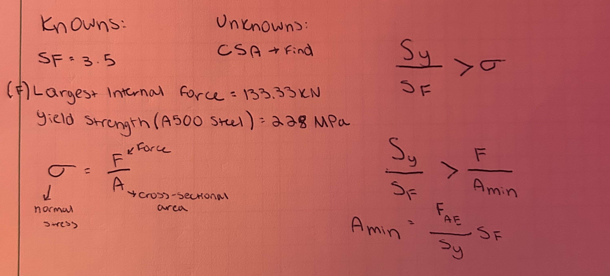
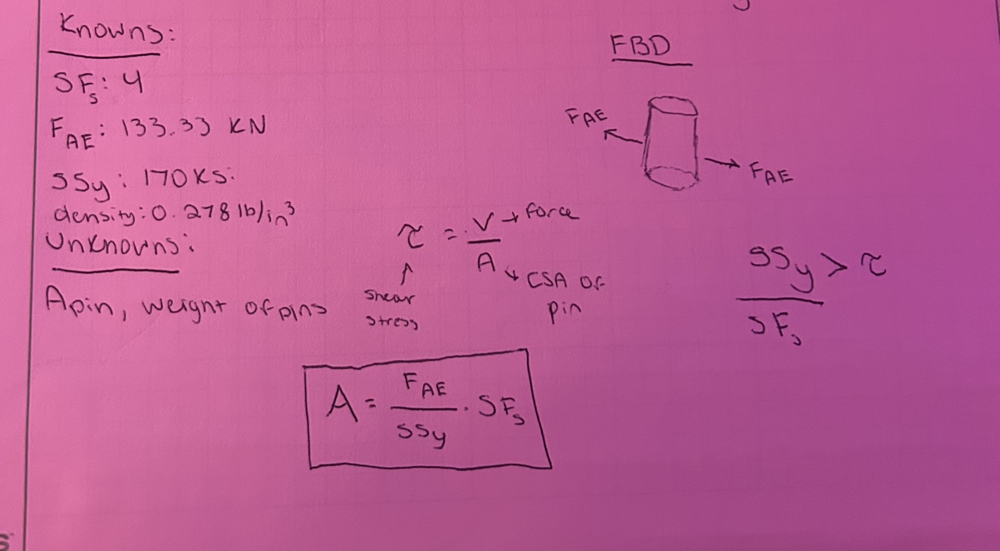

# A2 – Truss Stress Analysis

## Design of Truss

When looking at the requirements and objective for this assignment, I knew it would not be a short process. These sort of problems require a lot of time management and precision to complete, so I knew I had to break it up step by step. Looking at the provided diagram, my first thought was how am I going to draw this truss diagram so it is the most stable it can be. As I have heard many times before that "triangles are the strongest shape," this is what I came up with.

## Analysis of Truss

This setup fits the joints and members rule and seems to follow all the criteria well. Now that this was setup, it was time to separate the truss into each individual joint and the internal forces acting on them. The first step was to not worry about plugging in values, and keep each of the forces as variables. My procedure can be observed in the images below:

I most definitely ran into some issues that took up some time to debunk during this step. The first joint was the most difficult to analyze as I had to think through how each of the forces were acting on each other. However, with each joint I completed, I recognized a pattern with the trigonometry and how the forces related to one another. This allowed me to go a little quicker when solving for the equations of the other internal forces.

## Assign Numerical Values

Next it was time to numerically solve each of the numerical forces. While I could accomplish this using on paper substitution, I opted to use PTC MathCAD to simplify the calculations. I first provided the givens, then I used those values to substitute into the variables I created. 

I was definitely surprised at how large the magnitude of the forces are. I was expected member CD to be the largest, but was shocked to learn member AE had the largest force acting on it. We will use this force for the next few steps.

## Cross Sectional Area of Members

Next it was time to calculate the minimum cross-sectional area required for the truss to not fail, given the specifically provided safety factor of 3.5. For this step I was a little confused, as a said the yield strength was given, yet I did not see it provided anywhere. I then figured that since the material was provided to us, it was intentioned for us to look up the likely yield strength of the material. To my surprise, there was many yield strengths for many different conditions. I chose to pick the smallest one as that would allow for the greatest guarantee that the conditions meet the factor of safety. 

It is crucial that the stress meets way below the yield strength so there is no fear of the structure failing in any possible way. That is why I symbolically calculated for the minimum area, as any area larger than the one I calculated for will work. The next step was to plug in the values and get a numerical calculation for the cross-sectional area.

## Cross Sectional Area of Pins

The next course of action is to analyze the shear stress enacting on the pins to find the minimum cross sectional area of the pins. Below is the symbolical analysis of these findings:

I noticed after rereading the directions that the directions of my arrows in the FBD are inverted, as the system is intended to be in compression rather than in tension. This process was very similar to the process of finding the cross sectional area of the members, just with different variables. I then reused MathCAD to input the values into the variables. 

Even after solving for the weight, I am unsure if that would be the right value. I tried to think about it logically, so i multiplied the density by the cross sectional area, then by 3 times the value of a to measure the distance between the pins. Finally, because there are two pins I multiplied by two since it would be approximately double the weight. The other calculations were rather straightforward.

## CAD Section

Now it is time for the difficult section. Although it seems like a simple build to construct, with my limited CAD knowledge, I struggled a lot with this section. I was able to manage to sketch out the truss with accurate dimensions as shown below: 

