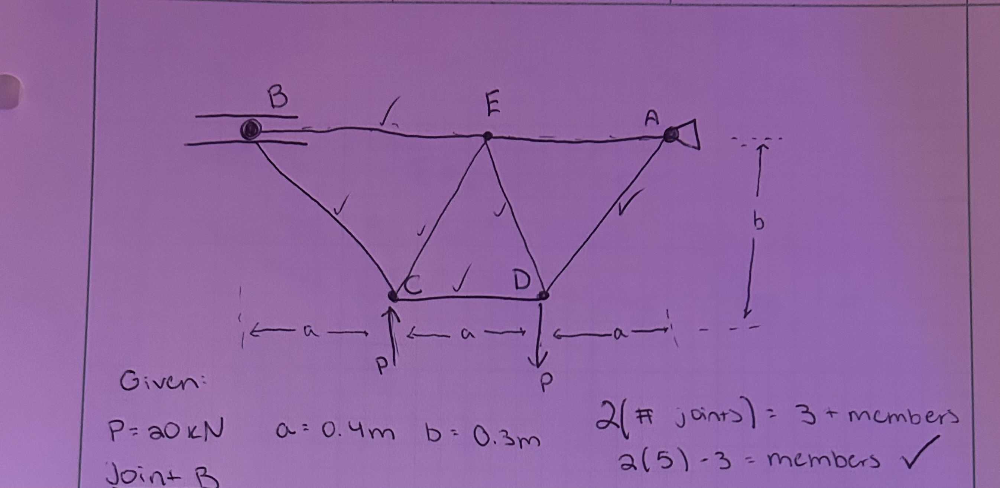
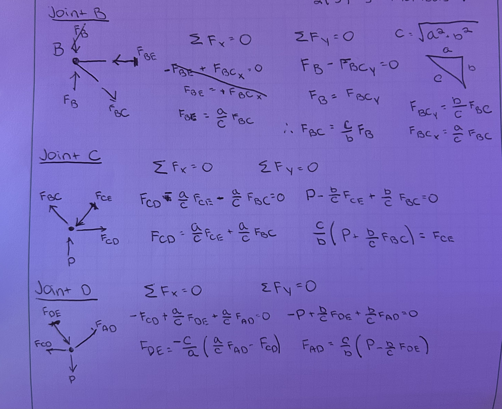
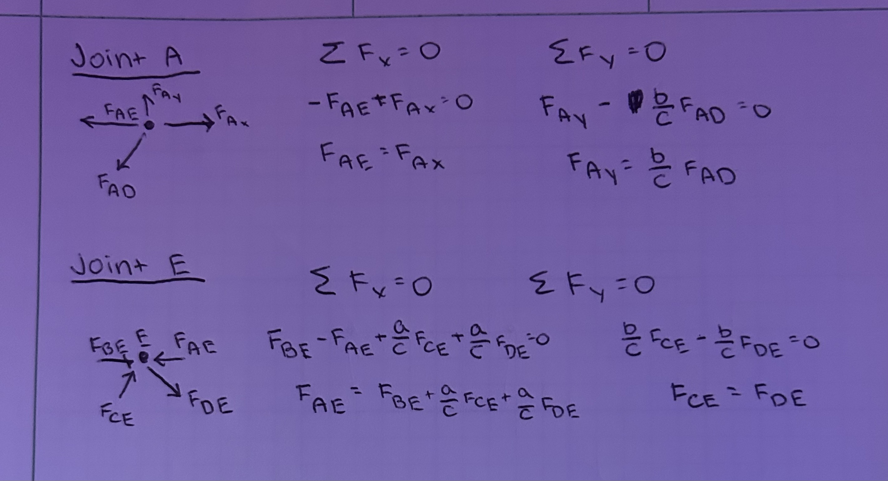

# A2 – Truss Stress Analysis

## Design of Truss

When looking at the requirements and objective for this assignment, I knew it would not be a short process. These sort of problems require a lot of time management and precision to complete, so I knew I had to break it up step by step. Looking at the provided diagram, my first thought was how am I going to draw this truss diagram so it is the most stable it can be. As I have heard many times before that "triangles are the strongest shape," this is what I came up with.

This setup fits the joints and members rule and seems to follow all the criteria well. Now that this was setup, it was time to separate the truss into each individual joint and the internal forces acting on them. The first step was to not worry about plugging in values, and keep each of the forces as variables. My procedure can be observed in the images below:

