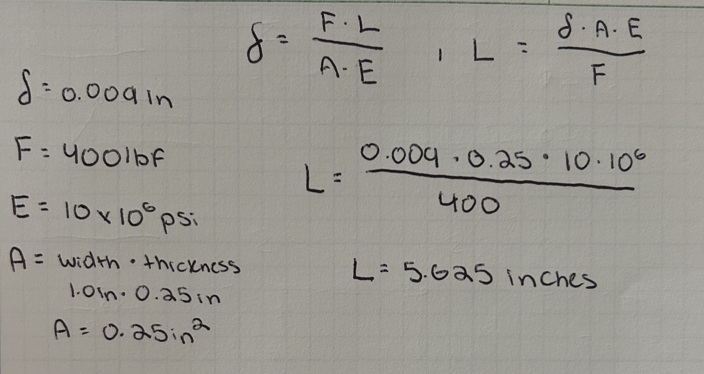
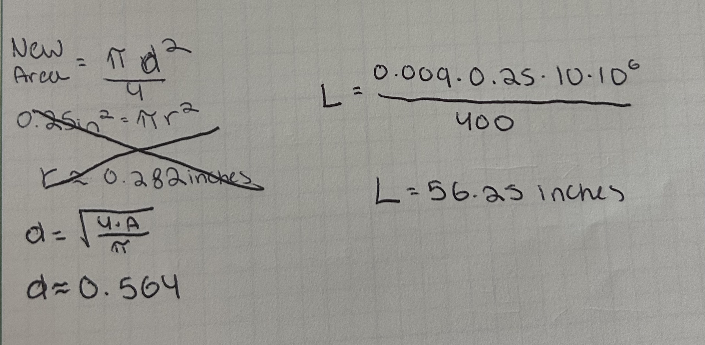
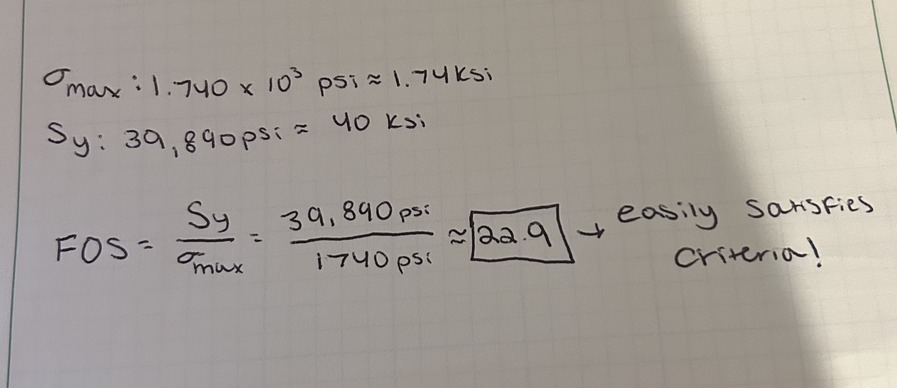
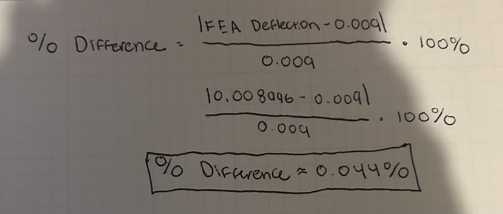

# A3 – Parametric and FEA

## Parametric Design

The first steps for this assignment is to analyze the problem and gather what exactly we are looking to design. A sketch was already provided so there was no need for me to sketch out an FBD of the bar on paper. It is important to recognize that the bar has a distributed load being acted by it, one that we can choose between 300lbf and 500lbf to satisfy the criteria. It is to have no more than an Axial deflection of 0.009 inches and the bar is to be constructed of Aluminum with a Young's Modulus of between 8.5-11.5 x 10^6 psi. 

### Solve for Values

Before I can focus on designing the beam in Solidworks, I first have to establish a few measurements that are well within the criteria. When taking into account what was already provided, the only thing still left unknown is the length of the bar. I solved for this using the direct tension elongation equation;

I assigned the distributed force to be 400lbf and the Modulus of Elasticity to be 10 x 10^6 psi as both values are directly in the middle of the provided ranges. I also chose a random value for the width and height/thickness of the bar, and used these randomly selected values to solve for the length of the bar as demonstrated above. I did make a calculation error, the final length calculated is actually 56.25 inches. 

### CAD Design

When starting my design process, it was time to start creating some variables I can use to make assigning numerical values a lot easier. 

It took me a few minutes to discover how to work this table and assign the equations and variables the right away. i attempted to use the variable, "Thickness," however the computer was unable to allow it for some reason. I changed it to "height" instead. 

After finishing the rough geometry of the bar, I went back to read the instructions. I noticed a critical error I had missed, the cross sectional area must be circular. While I was confident I could recover from this mistake, I was frustrated I had missed such a significant detail. 

I knew I had to redefine my variables and guarantee that they all have values that satisfy the conditions. 

After reevaluating, I realized all of my variables including my length can remain the same as long as I ensure my cross sectional area is still 0.25in^2. This just means I had to solve for what diameter would satisfy that given area. 

Now that I am on track with the correct values and geometry in mind, it was time to start constructing the bar again. I started by redefining any values and equations and extruding the circular cross section into a full member;

## Assigning a Material 
The next step is to attach a material to the member. When picking a material, it is important to pick one that was as close as possible to my chosen Modulus of Elasticity as well the required yield strength target of 40ksi. Given there was hundreds of materials to choose from, I utilized AI to help narrow down which material would be a good fit. It suggested Aluminum 6061-T6 and I was very satisfied with it's suggestion. 

## Assigning Loads
After the material was assigned, the next step was to apply the fixture and load to the bar as provided in the initial sketch. It was an important detail for myself to remember that the force acting on the bar was a tensile force rather a compressive force. This can be observed in the below image. 

## Deflection & Von Mises Map
After the loads were attributed to the beam, it was time to create a mesh and run a study on the beam. It is here that I can analyze where the highest stress, strains and maximum displacements are on the bar. Below are images of the different maps generated by the bar;

The Von Mises and deflection maps above show that the highest stresses are present near the fixed support, while the highest displacements are located near the distributed force on the other end of the bar. The highest recorded stress across the beam is 1.74 ksi. We can use this stress alone with the yield strength for the material(40ksi) to determine how large of a safety factor we have.

It is more than evident in the above calculation that the bar is nowhere near failure is well within the factor of safety. 

## Percentage Difference

The next objective was for me to analyze the percentage difference between the provided maximum axial deformation of the bar versus the maximum recorded deformation based on the map. The calculation is demonstrated below;

